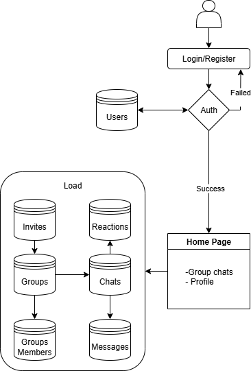

# ChatLite Prototype

This document summarizes the key design decisions made when implementing the **ChatLite** prototype for the Manivis interview exercise. The live app can be found at: [https://chatlite-jhlu.onrender.com](https://chatlite-jhlu.onrender.com)

## Repository organization

```
ChatLite-main/
├── api/                   # API routes
│   ├── auth.js            # Authentication (login/register)
│   ├── groups.js          # Group management
│   ├── messages.js        # Messages and WebSockets
│   ├── reactions.js       # Reaction system
│   ├── profile.js         # User profiles
│   ├── upload.js          # File uploads
│   ├── invites.js         # Invitation system
│   └── utils/             # Utilities
├── prisma/                # Database
│   ├── schema.prisma      # Prisma schema
│   └── migrations/        # Migrations
├── public/                # Static files
│   ├── index.html         # Login page
│   ├── app.html           # Main application (profile, groups and chats display)
│   ├── join.html          # Invitation page
│   └── styles.css         # CSS styles
├── src/
│   └── server.js          # Main server
├── tests/                 # Tests
└── package.json           # Dependencies and scripts
└── .env                   # Sensitive environment variables (database, image storage); not committed to the repository
 
```

---

## General workflow

### Database


#### `Users`
| Column        | Type      | Notes                              |
|---------------|-----------|------------------------------------|
| `id`          | String PK | UUID                               |
| `username`    | String    | **Unique**                         |
| `passwordHash`| String    | bcrypt hash                        |
| `displayName` | String?   | optional                           |
| `avatarUrl`   | String?   | optional                           |
| `createdAt`   | DateTime  | default now()                      |

---

#### `Groups`
| Column        | Type      | Notes                              |
|---------------|-----------|------------------------------------|
| `id`          | String PK | UUID                               |
| `name`        | String    |                                    |
| `description` | String?   | optional                           |
| `creatorId`   | String FK | → `Users.id`                       |
| `createdAt`   | DateTime  | default now()                      |

**Relations:**  
- A group **belongs to** a creator (`creatorId`).  
- A group **has many** members (`GroupMembers`), messages (`Messages`), and invites (`Invites`).

---

#### `GroupMembers`
| Column      | Type        | Notes                                        |
|-------------|-------------|----------------------------------------------|
| `groupId`   | String FK   | → `Groups.id`                                |
| `userId`    | String FK   | → `Users.id`                                  |
| `role`      | Enum        | `OWNER` \| `MEMBER` (optionally `MANAGER`)    |
| `joinedAt`  | DateTime    | default now()                                 |

**Primary key / uniqueness:**  
- **Composite PK / unique:** `@@id([groupId, userId])` (a user can join a group only once)

---

#### `Messages`
| Column      | Type        | Notes                              |
|-------------|-------------|------------------------------------|
| `id`        | String PK   | UUID                               |
| `groupId`   | String FK   | → `Groups.id`                      |
| `userId`    | String FK   | → `Users.id`                       |
| `content`   | String      | may be empty if `imageUrl` present |
| `imageUrl`  | String?     | optional (message image)           |
| `createdAt` | DateTime    | default now()                      |

---

#### `Reactions`
| Column      | Type        | Notes                                         |
|-------------|-------------|-----------------------------------------------|
| `messageId` | String FK   | → `Messages.id`                               |
| `userId`    | String FK   | → `Users.id`                                   |
| `emoji`     | String      | Unicode emoji (e.g., "👍")                     |
| `createdAt` | DateTime    | default now()                                  |

**Primary key / uniqueness:**  
- **Composite PK / unique:** `@@id([messageId, userId, emoji])`  
  (each user can react **once per emoji** on a given message)

---

#### `Invites`
| Column        | Type        | Notes                                      |
|---------------|-------------|--------------------------------------------|
| `token`       | String PK   | random/UUID token in join URL              |
| `groupId`     | String FK   | → `Groups.id`                              |
| `createdById` | String FK   | → `Users.id` (who generated the invite)    |
| `createdAt`   | DateTime    | default now()                              |
| `expiresAt`   | DateTime?   | optional (future: expiring invites)        |
| `uses`        | Int         | optional (future: limited-use invites)     |


### Chat app

The interaction flow is as follows

- The initial page (`public/index.html`) handles user registration and login, interacting with the **Users** table.  
  For testing, you can create your own profile or use one of the following predefined accounts:

| username | password |
| ------ | ------ |
| user | 1234   |
| user-dad | 1234   |
| user-mom | 1234   |
| user-brother | 1234   |
| user-sister | 1234   |

- After a successful login, the profile, groups, and chat interface are displayed in `public/app.html`, where interactions with the other database tables occur.



---

## Technologies used

- **Backend framework:** Node.js with Express — for routing, middleware, and serving both API and static frontend.
- **Authentication:** JWT (jsonwebtoken) for token-based auth, with bcrypt for secure password hashing.
- **Database & ORM:** PostgreSQL accessed through Prisma ORM for schema migrations, queries, and type safety.
- **Real-time communication:** Socket.IO (built on WebSockets) for live messaging and emoji reaction updates.
- **File uploads:** Multer (middleware) for handling image uploads, with Cloudinary as the storage backend.
- **Frontend:** Plain HTML, CSS, and vanilla JavaScript for simplicity and clarity of the prototype.
- **Emoji handling:** Standard Unicode emojis rendered directly in text and reactions (no heavy external library).
- **Testing:** Vitest for unit tests and Supertest for API integration tests.  
  The implemented unit test (`tests/reactions.test.js`) verifies the helper function in `api/utils/reactions.js`, which aggregates the number of reactions per message during the `messages:get` operation.


---

## Free services used

- **Image storage.**  
  Used **Cloudinary** because serving images directly from the database or local disk is inefficient. A CDN-backed service scales better.
  **Trade-offs**: Free plan has strict storage and bandwidth limits.  
  **Future improvements**: For production, consider either a Cloudinary-like service with a premium plan or company-owned storage

- **Database storage.**  
  Used **Postgres on Render free tier** because it integrates easily with Prisma and supports relational features needed for users, groups, and messages.  
  **Trade-offs**: Free plan has limited storage and connections, and may be slower under load.  
  **Future improvements**: Migrate to a managed database service with higher quotas and monitoring

- **App host.**  
  Used **Render free tier** for hosting the Node.js server and serving the static frontend. It provides simple integration with GitHub, automatic redeploys, and supports both the API and Socket.IO connections in one place.
  **Trade-offs**: Free plan enforces cold starts (server sleeps after ~15 minutes idle) and limited performance.  
  **Future improvements**: Upgrade to a paid plan for always-on uptime, or containerize the app for deployment to a company-managed environment (e.g. Kubernetes, AWS ECS).
 **Notes**: Well-suited for rapid prototyping and straightforward deployment.

---


# Concluding Remarks and Future Work

- The current design requires more careful evaluation to identify the most suitable technologies for **image upload and storage**, **database management**, and **application deployment**.  
- Scalability is a concern: messages are currently handled in a single database instance. Future work should explore partitioning, caching, or queue-based architectures to support higher traffic and reduce load.  
- The frontend is intentionally minimal. Significant improvements are needed for **user experience**, including smoother login flows, richer emoji interactions, and a more polished invitation process.  
- The database schema already supports features not yet implemented in the prototype, such as:
  - Finite-duration invites (expiring links).  
  - Support for the full emoji set.  
  - Account deletion.  
  - Role-based permissions (e.g., managers vs. members).  
  - Member management (remove members, leave a group).  
- **Security considerations**: The passwords are hashed but the messages are stored as strings with its full content
- **Testing improvements**: expand beyond unit tests to include more integration tests and end-to-end (E2E) tests for core flows (register → join group → chat).  
- **Deployment improvements**: add CI/CD pipeline for automated tests and deployments, and move from free-tier hosting to a production-ready environment.  
- **Monitoring and observability**: include logging, error tracking, and performance metrics to detect and debug issues at scale.  
